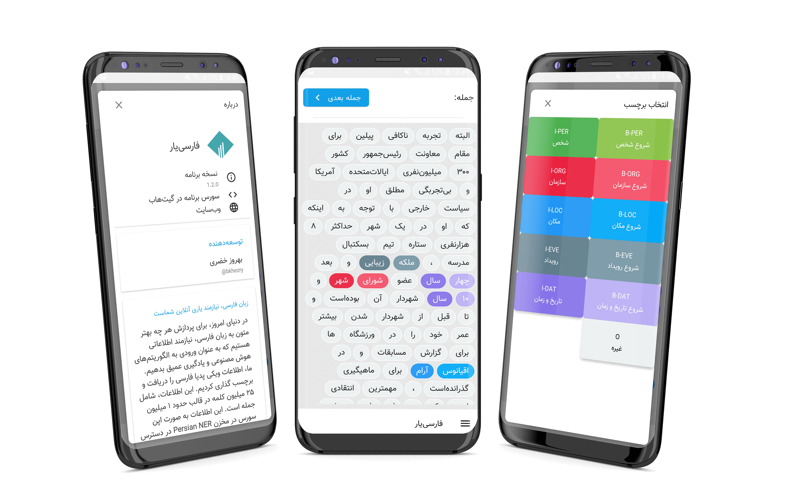

# فارسی‌یار

اپلیکیشن اندروید: برنامه برچسب‌زنی پیکره‌های پردازش متن

**نیاز‌مندی‌ها**
- Android Studio 3.3.0
- JDK 8
- Android SDK Build tools 28.0.3
- Supports API Level +17
- Support libraries with androidx v1.0.0

**کتابخانه‌ها**
- [Support libraries]: appcompat / recyclerview / constraintlayout
- [Material Design 2]: MaterialCardView / MaterialButton / Bottom App Bars
- [FastAdapter]: The bullet proof, fast and easy to use adapter library, which minimizes developing time to a fraction
- [AndroidUtilCode]: is a powerful & easy to use library for Android. 
- [Calligraphy3]: Custom fonts in Android the easy way
- Square [Retrofit] / [Okhttp] / [Logging-Interceptor]
- Firebase Core / Crashlytics / Messaging
- [ButterKnife]: Bind Android views and callbacks to fields and methods.

[Support libraries]: https://developer.android.com/jetpack/androidx/
[Material Design 2]: https://material.io/develop/android/
[FastAdapter]: https://github.com/mikepenz/FastAdapter
[AndroidUtilCode]: https://github.com/Blankj/AndroidUtilCode
[Calligraphy3]: https://github.com/InflationX/Calligraphy
[Retrofit]: https://github.com/square/retrofit
[Okhttp]: https://github.com/square/okhttp
[Logging-Interceptor]: https://github.com/square/okhttp/tree/master/okhttp-logging-interceptor
[ButterKnife]: https://github.com/JakeWharton/butterknife
